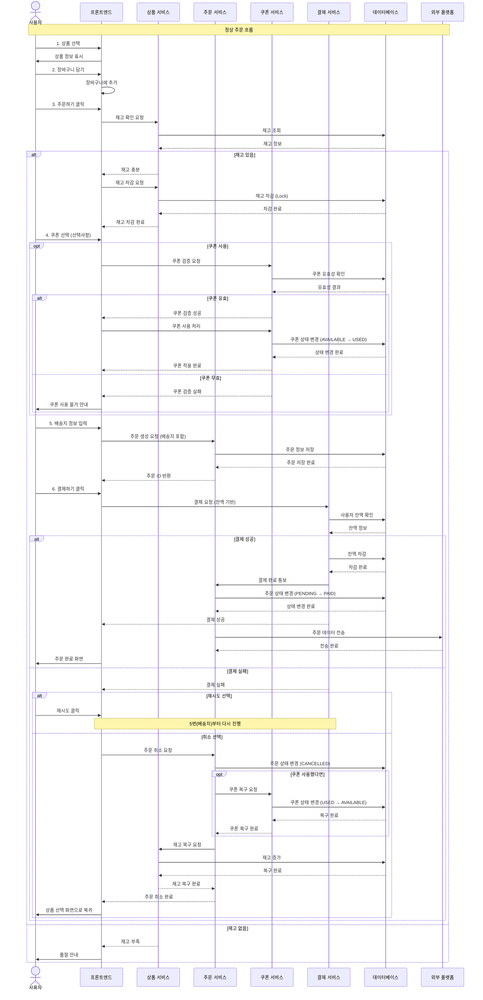

# 주문/결제 프로세스 시퀀스 다이어그램

## 주요 단계

1. **상품 선택 및 장바구니**: 사용자가 상품을 선택하고 장바구니에 담음
2. **재고 확인 및 차감**: 주문 시 재고를 확인하고 즉시 차감 (동시성 제어)
3. **쿠폰 검증 및 적용**: 선택 시 쿠폰 유효성 검증 후 사용 처리
4. **배송지 입력**: 수령인, 주소, 연락처 입력
5. **결제 처리**: 잔액 기반 결제 진행
6. **주문 완료**: 결제 성공 시 외부 플랫폼에 데이터 전송
7. **롤백 처리**: 결제 실패 시 재고/쿠폰 복구

## 주요 특징

- **동시성 제어**: 재고 차감 시 Lock 사용
- **트랜잭션**: 각 단계별 원자성 보장
- **롤백**: 실패 시 재고/쿠폰 자동 복구
- **재시도**: 결제 실패 시 사용자가 재시도 선택 가능
